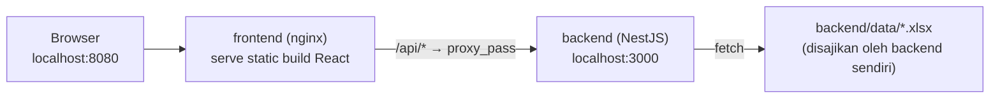

# Menjalankan Proyek dengan Docker

Dokumen ini menjelaskan setup Docker pada repository ini: apa yang dijalankan, bagaimana kedua service saling terhubung, dan cara build/run/debug-nya. Untuk menjalankan proyek tanpa Docker (`npm run dev` / `npm run start:dev`), lihat [README.md](README.md).

## Arsitektur



- **frontend**: multi-stage build — `npm run build` menghasilkan static file, lalu disajikan oleh nginx. Nginx juga meng-*proxy* semua request `/api/*` ke container backend, sehingga browser hanya perlu tahu satu origin (`localhost:8080`) dan tidak terkena masalah CORS.
- **backend**: multi-stage build — `nest build` lalu dijalankan dengan `node dist/main` di image Node yang minimal (hanya dependency production).
- Kedua container terhubung lewat network default yang dibuat otomatis oleh `docker compose`. Di dalam network itu, frontend memanggil backend menggunakan nama service (`http://backend:3000`), bukan `localhost`.

## Prasyarat

- Docker Desktop terpasang dan menyala (`docker info` harus berhasil, tidak error).
- Tidak ada proses lain yang memakai port **3000** atau **8080** di host (misalnya backend lokal yang sedang `npm run start:dev`) — hentikan dulu sebelum `docker compose up`, atau ganti port mapping di `docker-compose.yml`.

## Menjalankan

Dari root repository:

```bash
docker compose up --build
```

- Frontend: [http://localhost:8080](http://localhost:8080)
- Backend API langsung (opsional, untuk debug): [http://localhost:3000/api/evidence](http://localhost:3000/api/evidence)

Jalankan di background:

```bash
docker compose up -d --build
```

Hentikan:

```bash
docker compose down
```

`--build` hanya perlu dipakai saat ada perubahan kode/dependency. Setelah image pertama kali dibuat, `docker compose up` saja sudah cukup untuk menyalakan ulang container yang sudah ada.

## File-file terkait

| File | Fungsi |
| --- | --- |
| `Dockerfile` | Build image frontend (Vite build → nginx). |
| `backend/Dockerfile` | Build image backend (Nest build → runtime Node). |
| `nginx.conf` | Konfigurasi nginx: serve static file + proxy `/api` ke backend. |
| `docker-compose.yml` | Mendefinisikan kedua service, port mapping, dan environment variable. |
| `.dockerignore`, `backend/.dockerignore` | Mengecualikan `node_modules`, `dist`, file test, dsb. dari build context. |

## Environment variable di dalam Docker

Environment variable untuk Docker **berbeda mekanismenya** dari environment lokal (`.env` / `.env.local`) — jangan asumsikan keduanya otomatis sinkron.

| Variabel | Diset di | Kapan berlaku | Catatan |
| --- | --- | --- | --- |
| `VITE_API_URL` | `docker-compose.yml` → `frontend.build.args` | **Saat image di-build**, bukan saat container start | Vite membakar (inline) nilai ini ke dalam JS bundle. Defaultnya `/api` (path relatif), supaya nginx yang mem-proxy — bukan browser yang langsung memanggil origin backend. Kalau nilai ini diubah, image frontend harus di-*rebuild*. |
| `CORS_ORIGIN` | `docker-compose.yml` → `backend.environment` | Saat container backend start | Karena akses selalu lewat proxy nginx (same-origin), variabel ini praktis tidak berpengaruh untuk alur normal. Tetap berguna kalau backend diakses langsung dari origin lain. |
| `EVIDENCE_WORKBOOK_URL` | `docker-compose.yml` → `backend.environment` | Saat container backend start | Default mengarah ke `http://localhost:3000/static/...` — ini valid karena backend meng-*fetch* dirinya sendiri di dalam container yang sama. Untuk production, ganti ke URL workbook yang sesungguhnya (mis. SharePoint). |

File `backend/.env` dan `.env.local` di root **tidak dipakai** oleh container — keduanya untuk mode `npm run dev` lokal. Compose hanya membaca `environment:` di `docker-compose.yml` (atau file `.env` di root repo jika kamu menambahkannya sebagai `env_file`).

## Catatan penting: file workbook contoh

`backend/data/audit_dashboard_excel_simulation_revised.xlsx` **di-gitignore** — file ini ada di mesin development karena dibuat manual/lokal, bukan karena ikut ter-*commit*. `backend/Dockerfile` meng-copy folder `backend/data` apa adanya, sehingga:

- Build akan berhasil selama file itu ada di working directory kamu saat `docker compose build` dijalankan.
- Kalau repo ini di-clone fresh di mesin/CI lain tanpa file tersebut, step `COPY data ./data` akan menghasilkan folder `data` kosong, dan `EVIDENCE_WORKBOOK_URL` default akan gagal fetch (404).

Dua opsi untuk deployment/production:
1. Commit file workbook contoh ini ke repo (hapus dari `.gitignore`), atau
2. Set `EVIDENCE_WORKBOOK_URL` ke URL workbook yang sesungguhnya (SharePoint, dsb.) lewat environment variable saat deploy, sehingga backend tidak bergantung pada file lokal sama sekali.

## Deploy ke environment lain (staging/production)

`docker-compose.yml` saat ini berisi nilai default untuk **local dev** (`localhost`). Untuk staging/production, override lewat salah satu cara berikut tanpa mengubah file utama:

```bash
# docker-compose.override.yml (tidak di-commit, atau commit sebagai contoh dengan nama beda)
services:
  backend:
    environment:
      CORS_ORIGIN: https://staging.example.com
      EVIDENCE_WORKBOOK_URL: https://sharepoint.example.com/evidence.xlsx
  frontend:
    build:
      args:
        VITE_API_URL: /api   # tetap /api selama nginx tetap jadi reverse proxy
```

```bash
docker compose -f docker-compose.yml -f docker-compose.override.yml up --build
```

Atau set langsung lewat platform hosting (Railway, Fly.io, ECS, dll.) yang biasanya punya mekanisme environment variable sendiri per service.

## Troubleshooting

**`ports are not available: ... bind: Only one usage of each socket address...`**
Port 3000 atau 8080 sudah dipakai proses lain di host (kemungkinan besar `npm run start:dev` lokal). Hentikan proses tersebut, atau ubah port mapping di `docker-compose.yml` (mis. `"13000:3000"`).

**Frontend menampilkan data lama setelah ganti kode**
Rebuild image-nya — static build sudah "dibakar" ke dalam image saat `docker compose build`, jadi perubahan kode tidak otomatis muncul tanpa `--build` (Docker tidak meng-*hot reload* seperti `npm run dev`).

**`/api/*` dari frontend mengembalikan 502/504**
Backend belum siap atau namanya salah di `nginx.conf`. Pastikan service backend bernama `backend` di `docker-compose.yml` (nginx meng-*hardcode* `proxy_pass http://backend:3000/api/`), dan cek log dengan `docker compose logs backend`.

**Melihat log:**

```bash
docker compose logs -f backend
docker compose logs -f frontend
```
