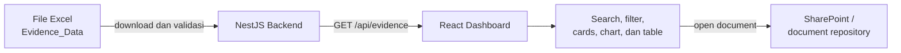

# Audit Management Dashboard

Dashboard web untuk membantu tim **Internal Audit Planning & Development** melihat, mencari, memfilter, dan memonitor metadata dokumen serta evidence audit dalam satu tempat.

Proyek ini dikembangkan sebagai Minimum Viable Product (MVP) untuk PT Telekomunikasi Indonesia International. Data evidence dibaca oleh backend dari file Excel, kemudian disajikan melalui API kepada dashboard frontend. Dokumen asli tetap berada di repository seperti SharePoint dan dapat dibuka melalui tautan pada setiap record.

## Fitur Utama

- Ringkasan jumlah dokumen untuk seluruh standard dan setiap ISO.
- Pencarian evidence berdasarkan nama dokumen.
- Filter berdasarkan ISO, lokasi, evidence status, dan compliance result.
- Visualisasi distribusi dokumen berdasarkan evidence status.
- Tabel evidence yang dapat diurutkan berdasarkan setiap kolom utama.
- Detail clause/control, due date, dan indikator dokumen overdue.
- Tautan langsung menuju dokumen atau folder sumber.
- Empty, loading, dan error state untuk pengalaman pengguna yang lebih jelas.
- Validasi struktur dan nilai data Excel di sisi backend.

## Teknologi

| Area | Teknologi |
| --- | --- |
| Frontend | React 19, TypeScript, Vite, Tailwind CSS 4, Lucide React |
| Backend | NestJS 11, TypeScript, ExcelJS |
| Testing | Jest, Supertest |
| Sumber data MVP | File Excel melalui URL yang dapat diakses backend |

## Arsitektur



Struktur backend menggunakan abstraksi `EvidenceSource`, sehingga sumber Excel dapat diganti dengan SharePoint atau sumber lain tanpa mengubah kontrak data yang digunakan frontend.

## Prasyarat

- Node.js 20 atau versi LTS yang lebih baru.
- npm.
- URL file `.xlsx` yang dapat diakses oleh backend tanpa autentikasi interaktif.

## Menjalankan Secara Lokal

### 1. Clone repository

```bash
git clone <repository-url>
cd audit-management-dashboard
```

### 2. Siapkan backend

```bash
cd backend
npm install
```

Buat file `backend/.env`:

```env
EVIDENCE_WORKBOOK_URL=https://example.com/evidence.xlsx
PORT=3000
CORS_ORIGIN=http://localhost:5173
```

Jalankan backend:

```bash
npm run start:dev
```

API akan tersedia di `http://localhost:3000/api`.

### 3. Siapkan frontend

Buka terminal baru dari root repository:

```bash
npm install
```

Buat file `.env.local` jika alamat API berbeda dari nilai default:

```env
VITE_API_URL=http://localhost:3000/api
```

Jalankan frontend:

```bash
npm run dev
```

Buka `http://localhost:5173` di browser.

### Alternatif: menjalankan dengan Docker

Proyek ini juga bisa dijalankan tanpa install Node/npm secara lokal, menggunakan Docker. Lihat [DOCKER.md](DOCKER.md) untuk detail arsitektur, cara build/run, dan konfigurasi environment-nya.

## Konfigurasi Environment

| Variabel | Lokasi | Wajib | Default | Keterangan |
| --- | --- | --- | --- | --- |
| `EVIDENCE_WORKBOOK_URL` | `backend/.env` | Ya | - | URL file Excel sumber metadata evidence. |
| `PORT` | `backend/.env` | Tidak | `3000` | Port HTTP backend. |
| `CORS_ORIGIN` | `backend/.env` | Tidak | `http://localhost:5173` | Origin frontend yang diizinkan. Pisahkan beberapa origin dengan koma. |
| `VITE_API_URL` | `.env.local` | Tidak | `http://localhost:3000/api` | Base URL API yang digunakan frontend. |

> Jangan commit file environment yang berisi URL atau kredensial sensitif. File `.env`, `.env.local`, dan `backend/.env` sudah diabaikan oleh Git.

## Format File Excel

Backend membaca worksheet bernama `Evidence_Data`. Baris pertama harus berisi header berikut (penulisan huruf besar/kecil tidak berpengaruh):

| Header | Format / nilai yang diterima |
| --- | --- |
| `Document ID` | Identifier evidence |
| `Document` | Nama dokumen; record tanpa nama akan dilewati |
| `Standards` | `ISMS`, `ITSMS`, `PIMS`, `BCMS`, `ABMS`, `OHSMS`, atau `ENMS` |
| `Clause` | Teks clause/control |
| `Location` | Teks lokasi atau unit |
| `Evidence status` | `Accepted`, `Pending Review`, `Rejected`, atau `Missing` |
| `Compliance result` | `Compliant`, `Partially compliant`, `Non-compliant`, atau `Not assessed` |
| `Due date` | Tanggal Excel atau teks `YYYY-MM-DD` |
| `Document URL` | URL dokumen/folder atau hyperlink pada cell Excel |

Contoh:

| Document ID | Document | Standards | Clause | Location | Evidence status | Compliance result | Due date | Document URL |
| --- | --- | --- | --- | --- | --- | --- | --- | --- |
| DOC-0001 | Firewall Configuration Review | ISMS | 8.1 Operational planning and control | Indonesia | Accepted | Compliant | 2026-05-20 | https://example.com/document.pdf |

Jika worksheet, header wajib, tanggal, atau nilai enum tidak valid, backend akan mengembalikan error yang menjelaskan sumber masalah.

## API

### `GET /api/evidence`

Mengembalikan seluruh metadata evidence yang valid dari workbook.

Contoh respons:

```json
[
  {
    "documentId": "DOC-0001",
    "document": "Firewall Configuration Review",
    "standards": "ISMS",
    "clause": "8.1 Operational planning and control",
    "location": "Indonesia",
    "evidenceStatus": "Accepted",
    "complianceResult": "Compliant",
    "dueDate": "2026-05-20",
    "documentUrl": "https://example.com/document.pdf"
  }
]
```

## Struktur Proyek

```text
audit-management-dashboard/
├── src/                         # Aplikasi React
│   ├── components/dashboard/    # Cards, filter, chart, dan table
│   ├── components/ui/           # Komponen UI reusable
│   ├── data/                    # Metadata ISO dan opsi filter
│   ├── services/                # Client API frontend
│   ├── types/                   # Tipe data TypeScript
│   └── utils/                   # Mapping, filter, sorting, dan formatting
├── backend/
│   ├── src/evidence/            # Module, controller, service, dan data source
│   ├── test/                    # End-to-end test
│   └── data/                    # Workbook simulasi untuk pengembangan
├── public/
└── README.md
```

## Scripts

Frontend (root repository):

```bash
npm run dev       # development server
npm run build     # type-check dan production build
npm run lint      # ESLint
npm run preview   # preview production build
```

Backend (`backend/`):

```bash
npm run start:dev # development server dengan watch mode
npm run build     # production build
npm run start:prod
npm run test      # unit test
npm run test:e2e  # end-to-end test
npm run test:cov  # test coverage
```

## Batasan MVP

- Belum tersedia authentication dan role-based access control (RBAC).
- Sumber data masih berupa file Excel; belum tersinkronisasi langsung dengan SharePoint.
- Dashboard bersifat read-only dan tidak menyimpan atau menganalisis isi dokumen.
- Perubahan repository dokumen tidak otomatis memperbarui metadata sebelum workbook sumber diperbarui.
- Kualitas informasi bergantung pada kelengkapan dan konsistensi metadata sumber.
- Filter clause/control belum tersedia sebagai kontrol terpisah pada UI.

## Pengembangan Berikutnya

- Integrasi langsung dan sinkronisasi berkala dengan SharePoint.
- Authentication dan pengaturan akses berdasarkan peran.
- Filter clause/control dan metadata tambahan seperti audit period, owner, business unit, country, dan audit category.
- Reporting, analytics, dan visualisasi tren yang lebih mendalam.
- Workflow upload, review, approval, dan audit yang terintegrasi.

## Status Proyek

Proyek berada pada tahap **MVP** dan ditujukan untuk penggunaan internal Unit Internal Audit Planning & Development.
